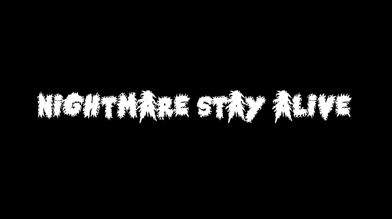

# Proyecto: Desarrollo de un Juego

### Integrantes:

 [Matias Carrizo](https://github.com/MattGoode7)

 [Gabriel Guillaumet](https://github.com/Pandulc)

 [Simon Llamosas](https://github.com/simonll4)

## Descripción:

Proyecto de curso para la materia Informatica II de la carrera Ingenieria en Informatica, Instituto Universitario Aeronautico.
El siguiente proyecto consiste en el desarrollo de un juego en el lenguaje C++, cuyo objetivo es poner en practica los
conocimientos adquiridos a lo largo del cursado de la materia.

Trailer: https://drive.google.com/file/d/1Qvtp7tonm9fj9x_ljmcA1AXsN9G3VlyK/view?usp=sharing

## Licencia de Assets utilizados

Balas:  

https://blackdragon1727.itch.io/pixel-bullet-16x16

Mapa:

https://www.deviantart.com/altegore/art/Fallout-d20-Oakley-Catering-sector-night-462022183

Personaje: 

https://opengameart.org/content/animated-top-down-survivor-player

Zombies:

https://opengameart.org/content/animated-top-down-zombie

## Capturas

